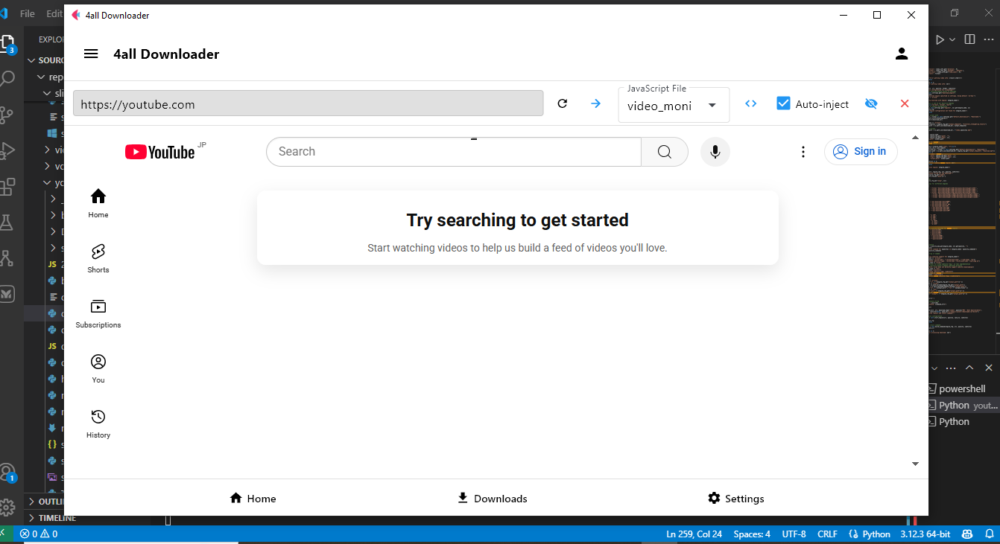
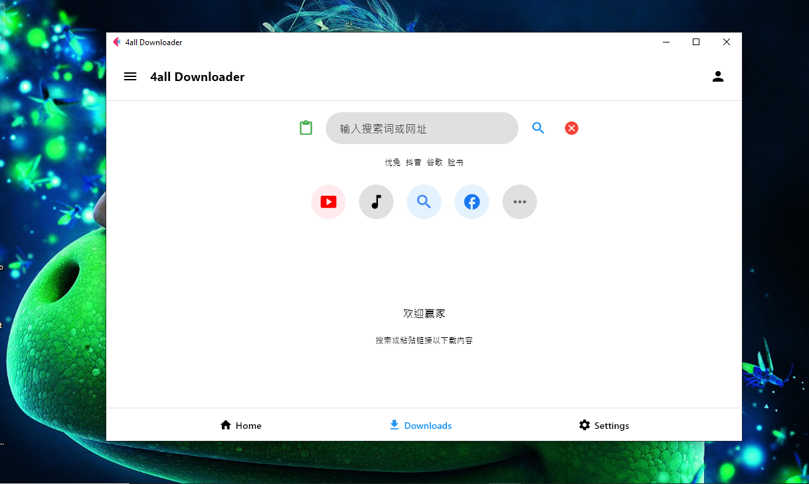
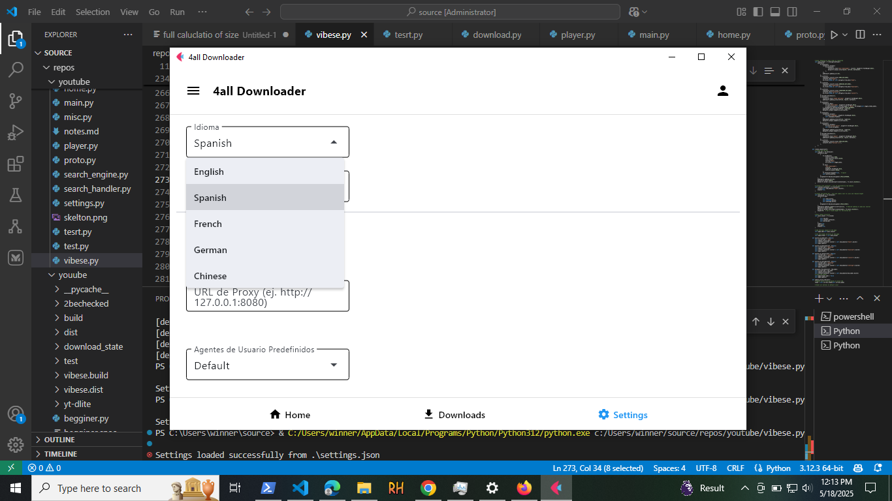
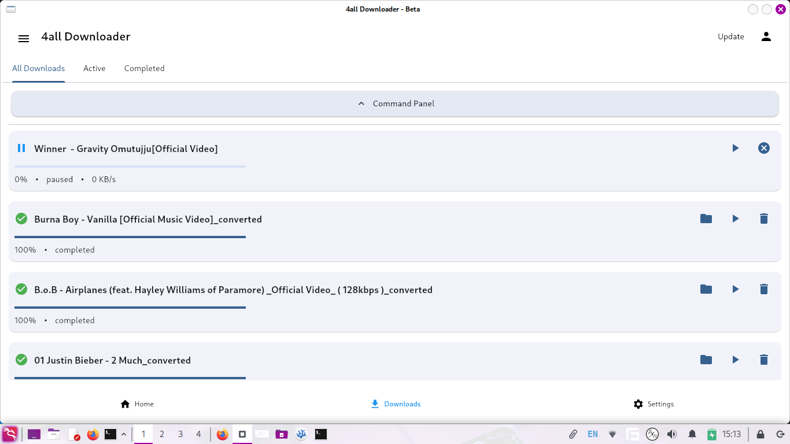
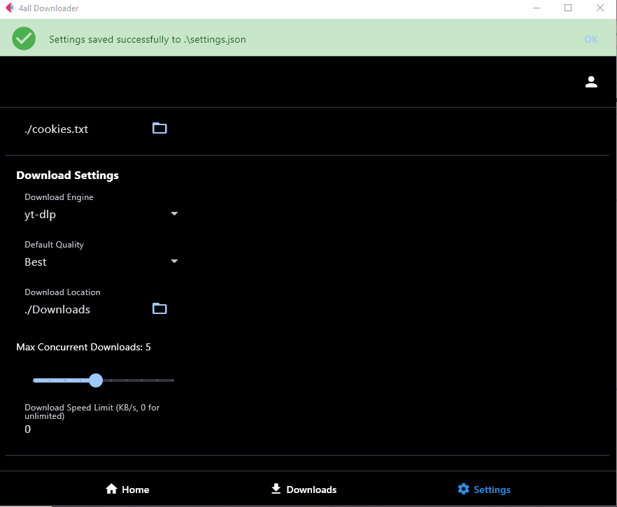
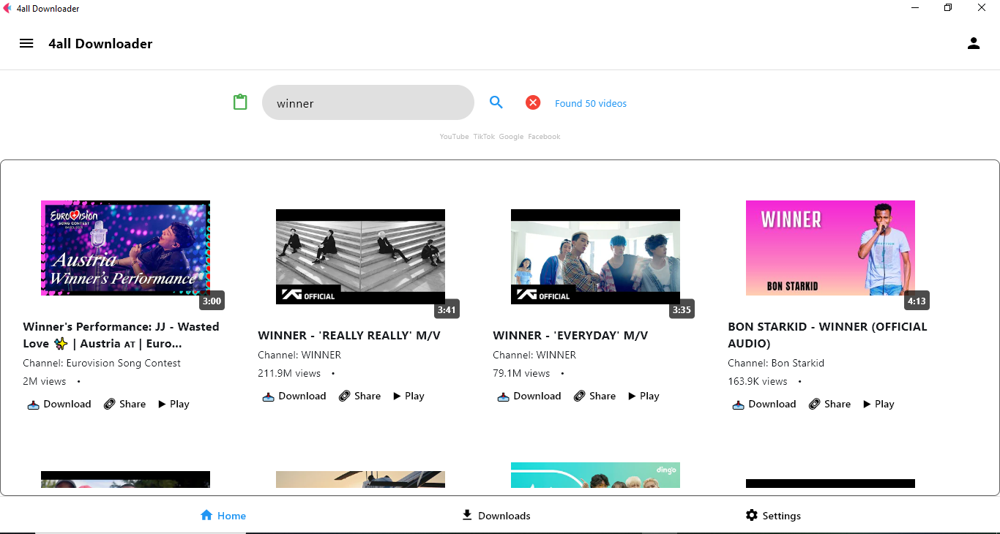

# 4all-downloader  
# 🚀 4all Downloader & Converter – "Infinity possibility"
## RELEASE IS AVAILABLE
https://1winner137.github.io/4all-downloader.web/ - documentation

**A sleek, cross-platform, all-in-one media downloader built for everyone. Lightweight, powerful, and fully customizable. Whether you're grabbing YouTube videos, full playlists, or high-speed direct downloads — 4all has you covered.**

---
 
> Biult in browser and freedom of javascript ,also show and hide browser.

  
> 🌍 **Every language is supported** – Choose your native tongue at startup for a fully localized experience.

---

## 🧠 Core Engine Features

- ⚙️ **Plug-and-play engine system**
  - Comes with `yt-dlp`, `aria2`, and `mx2` pre-configured — and will soon support Java-based crawling if needed.
  - Easily add your own engine by defining it in `settings.json`
  - Download even large files using built-in engines in addition to popular tools like Axel, Wget, and Mr. Curl.

- ♻️ **Resume ANY download**
  - Crash-resistant: every download is checkpointed with `.json`
  - Auto-resumes incomplete tasks on restart

- 🎯 **Pre-download smart naming**
  - Define your filename formats using templates like: `%(title)s_%(height)sp.%(ext)s`

- 🌐 **Subtitle support**
  - Optional subtitle download toggle (for supported platforms)

- 📂 **Custom download directory & formats**
  - Choose your preferred folder
  - Full control over video/audio format selection

- 🔐 **And 10+ secret power features**
  - Discover them while using — a true open-source gem.

---

## 🖥️ Modern User Interface  
**No longer limited to Tkinter — combines the power of Kivy, Flet, PyQt6, and CustomTkinter**

- 🧩 **Tabbed Layout**
  - `Active` and `Completed` downloads, always sorted with latest first
  - Clean, minimal look — no bloat

- 🛠️ **Settings Panel**
  - Choose accent color, proxy, cookies, and user-agent headers
  - Full language selection and customization options
  - Proxy support for regional access
  - Add cookies for private content
  - Download thread manager for parallel batch downloads

- 📊 **Live Progress Monitoring**
  - Intuitive controls: ▶️ Resume, ⏸️ Pause, ❌ Cancel
  - 📂 Open folder, 🗑️ Delete file – all from the same view

- 🔇 **Zero disruption**
  - No annoying pop-ups or alerts
  - All operations handled silently in background threads

- 🎬 **Built-in video preview**
  - Watch what you're downloading in real-time using the integrated **QPlayer** from PyQt6, FFmpeg, and YouTube-compatible video player

---

## 🔍 Built-in Search Engine

- 🔍 **Keyword-based search**
  - Search and download videos using keywords directly within the app
  - Supports YouTube and other major platforms with power to add custom engines
  - Able to download from **a limitless number of sites**
  - If a site isn't supported? Just plug in your own executable to download it

---

## 🌟 Additional Features

- 📋 **Playlist support**
  - Download entire playlists or select specific videos

- 🎨 **Theme customization**
  - Light and dark modes with accent color switching

- 🧰 **Multiple user modes**
  - **Novice:** One-click downloads
  - **Professional:** Advanced format chooser + thumbnails
  - **Expert:** Raw `yt-dlp` command interface

- 🛠️ **Built-in converter**
  - Convert videos to MP4, MKV, WebM, AVI, GIF, and more
  - Extract audio to MP3, WAV, M4A, and others

- 📜 **Download history**
  - Persistent, human-readable download log

- 🧩 **Dual Interface**
  - Use either the beautiful GUI or switch to full CLI mode

---

## 🔥 Why Choose 4all Downloader?

- 💡 Add **any engine** — no restrictions or vendor lock-in
- 🪶 Ultra-lightweight with multi-core support
- 🧱 Works **fully offline** (bundles dependencies)
- 🛠️ Advanced yet simple — every aspect can be configured
- 🧼 Uses clean, open `.json` config and history for portability
- 🏗️ Ideal for power users, media collectors, automation setups, and curious hackers

---

**4all Downloader is your ultimate universal media toolkit — open, expandable, and built for you.**

> 🍥 **Simple for beginners. Infinite for pros.**
